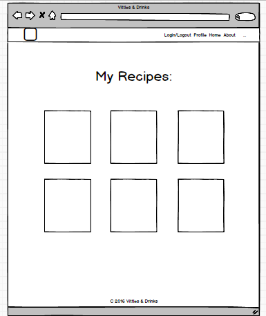
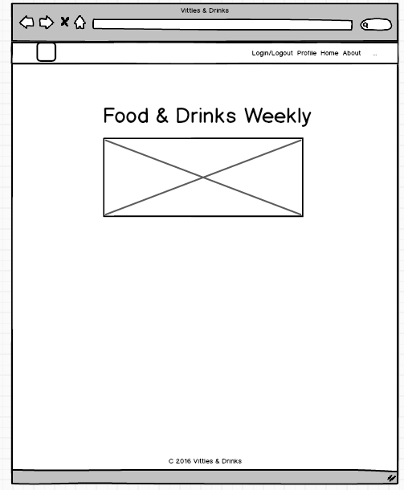
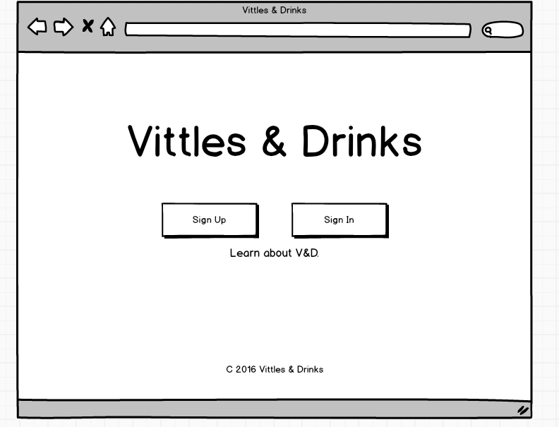
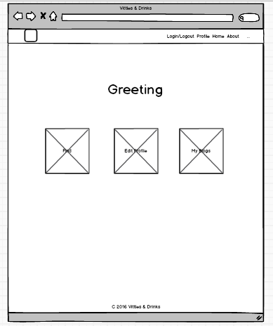
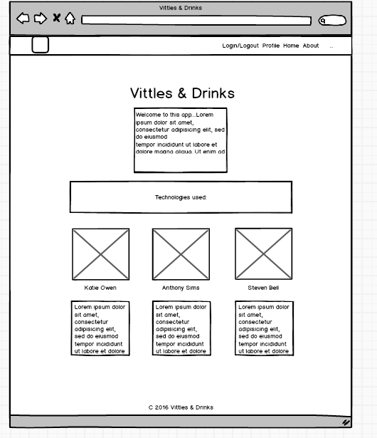

# WDI PROJECT 3: Vittles & Drinks

[See Vittles & Drinks on Heroku](https://vittlesanddrinks.herokuapp.com/)

## Developers

* [Steven Bell](https://github.com/thestevenbell)
* [Katie Owen](https://github.com/khowen)
* [Anthony Sims Jr.](https://github.com/sims226)

## Concept

We wanted to make an app that celebrated local and regional food. We thought about a dynamic food blog, a recipe generator, and finally settled on a simple recommendation engine that suggested Southern food & drink pairings based on user input.

For thematic inspiration, we looked to progressive Southern culture curators like the _Oxford American_, _Garden & Gun_ and especially _The Bitter Southerner_, an Atlanta-based online magazine that "honors genuinely honorable traditions” like drinking, singing, writing, playing, making things.

## Sketches & Wireframes

 
 

     

## Challenges

* *Different Strokes*
> Each developer came to the project with different skills and different approaches to problem solving. Establishing efficient rapport took time and effort.

* *Git Right or Git Left*
> While Git and GitHub are simple technologies to employ, version control demanded careful communication and explicit planning, even for a small team and a small project.

* *Jaded*
> Jade was a new technology for all of us. It's a great tool, but there is a learning curve, and it requires solid understanding of HTML and CSS.

* HTML5
* CSS3
* JavaScript
* MongoDB
* Mongoose
* ExpressJS
* Jade
* Bootstrap

## Future Plans

*  *Fatter Models*
  Our ultimate goal is to have a dynamically rendered page for each unique food pairing, and perhaps a range of custom templates for the pages. We'll need more sophisticated models to store that data.

*  *Advanced Logic*
  To convert simple user input (breakfast food, cold drinks, etc) into unique but attractive food pairings displayed on a dynamic page will require more logic.
*  *Thematic Development*
  We'd like to continue to refine the aesthetics of the site to reinforce the progressive regional culture of the site.

  
